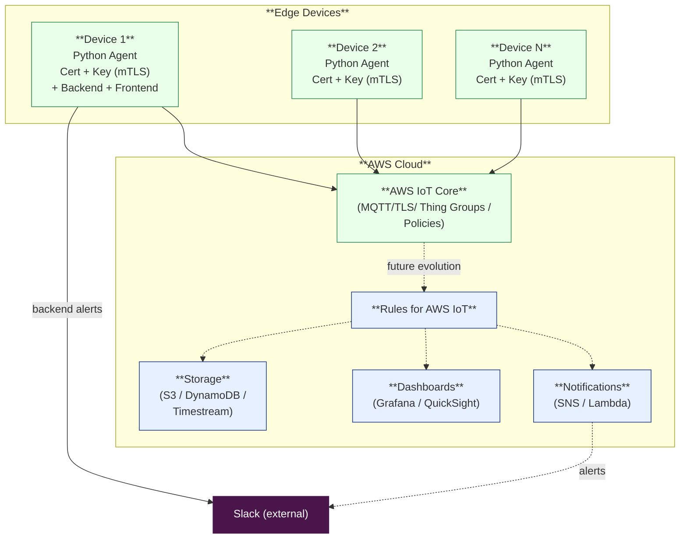

## Design Explanation

#### Now:
Hybrid strategy: Edge Devices connects to AWS IoT Core to send metrics using the MQTT protocol. The backend also connects to AWS IoT Core, makes the data available through a WebSocket, and sends alerts to Slack. The frontend consumes the exposed WebSocket.

#### Production: 
Edge Devices connects to AWS IoT Core, rules for AWS IoT replace backend, routing to Slack, storage services(if needs) and Dashboards.

## Security Considerations

* **mTLS:** Both the broker and the device authenticate each other using X.509 certificates.  
* **Encryption in transit:** All MQTT traffic is encrypted with TLS 1.2/1.3 on port 8883.  
* **Device certificates rotation:** Periodic certificate renewal or short-lived credentials to reduce the impact of key compromise.  
* **Least privilege policies:** IoT Core policies grant publish/subscribe only to allowed topics for each device.  
* **Per-device identities:** Each device has a unique certificate/identity to prevent spoofing or unauthorized access.  
* **Secure storage of keys:** Private keys are stored only on the device, with filesystem permissions locked to the agent user.  
* **Audit and logging:** Connection attempts, failures, and abnormal traffic are logged and monitored.  
* **Network segmentation:** Edge devices publish only via secure outbound traffic, no inbound ports exposed.  

