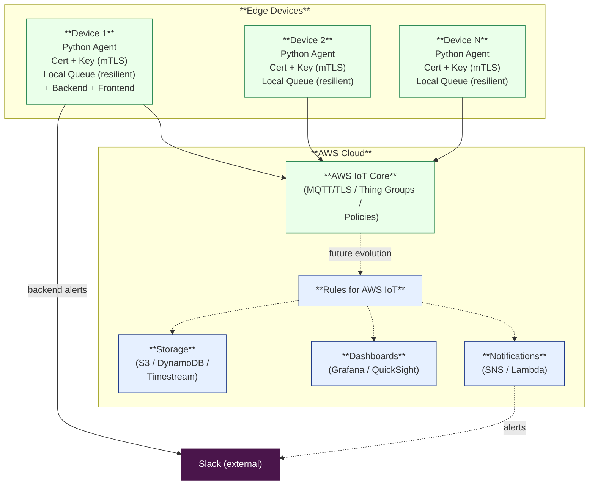

## Design Explanation

#### Now:
Hybrid strategy: Edge Devices connect to AWS IoT Core to send metrics using the MQTT protocol.The backend also connects to AWS IoT Core, makes the data available through a WebSocket, and sends alerts to Slack. The frontend consumes the exposed WebSocket.

⚡ New in this iteration: the Agent implements a local offline queue — if the device loses internet connection, metrics are buffered locally (in memory) and resent when connectivity is restored. This prevents data loss and increases reliability in unstable environments.

#### Production: 
Edge Devices connects to AWS IoT Core, rules for AWS IoT replace backend, routing to Slack, storage services(if needs) and Dashboards.

## Scalability

#### Now (between 20 - 60 devices)
- Use **Ansible** for provisioning:  
  - Automates agent installation (Python, venv, dependencies).  
  - Deploys `systemd` unit files and environment configs.  
  - Copies certificates and keys securely to each device.  
  - Applies updates (pull latest from repo, restart service).  
  - ⚡ Resilient metrics pipeline: metrics are queued locally if AWS IoT Core is unreachable, avoiding data loss.
- Benefits:  
  - Reduces manual setup.  
  - Ensures consistent configuration across all devices.  
  - Simplifies certificate renewal and rollout.
  - Provides robustness even in unstable network environments.  

#### Production (over 100 devices)
- **AWS IoT Greengrass**:  
  - Distributes the agent at scale.  
  - Manages the agent lifecycle (start, stop, update).  
  - Supports **OTA updates** without SSH access.  
  - Manages certificates centrally through AWS IoT Core.  
  - Enables running Lambda functions on edge devices for local preprocessing.  

## Trade-offs in the Hybrid Strategy

* **Simplicity vs. Scalability**  
  - ✅ Local queue avoids losing data during network outages.
  - ❌ In-memory queue has limits (configurable max length). Persistent storage (SQLite) may be needed at scale.
  - ✅ Keeping backend and frontend on Device 1 makes the setup simple for demos and small deployments.  
  - ❌ But it doesn’t scale well to thousands of devices, since a single device becomes a central point.  

* **Local control vs. Cloud integration**  
  - ✅ Local backend gives immediate Slack alerts and WebSocket data even if cloud connectivity is unstable.  
  - ❌ Requires maintaining backend code on at least one device, increasing operational complexity.  

* **Low latency vs. Maintainability**  
  - ✅ Local backend reduces latency for metrics aggregation and alerting.  
  - ❌ Cloud-native routing (via AWS IoT Rules) is easier to maintain and scale in the long run.  

* **Security vs. Operational overhead**  
  - ✅ TLS/mTLS ensures strong device identity and encrypted traffic.  
  - ❌ Managing certificates across many devices requires automation (renewals, revocations, rotations).  

* **Flexibility vs. Consistency**  
  - ✅ Local backend can be customized (e.g., extra business logic before forwarding metrics).  
  - ❌ Different deployments may diverge unless standardized, risking inconsistencies.  

* **Cost vs. Reliability**  
  - ✅ Running part of the system locally reduces cloud usage costs.  
  - ❌ But puts more responsibility on devices (monitoring, logs, failures), which may be harder to manage at scale.  

## Security Considerations

* **mTLS:** Both the broker and the device authenticate each other using X.509 certificates.  
* **Encryption in transit:** All MQTT traffic is encrypted with TLS 1.2/1.3 on port 8883.  
* **Device certificates rotation:** Periodic certificate renewal or short-lived credentials to reduce the impact of key compromise.  
* **Least privilege policies:** IoT Core policies grant publish/subscribe only to allowed topics for each device.  
* **Per-device identities:** Each device has a unique certificate/identity to prevent spoofing or unauthorized access.  
* **Secure storage of keys:** Private keys are stored only on the device, with filesystem permissions locked to the agent user.  
* **Audit and logging:** Connection attempts, failures, and abnormal traffic are logged and monitored.  
* **Network segmentation:** Edge devices publish only via secure outbound traffic, no inbound ports exposed.  

